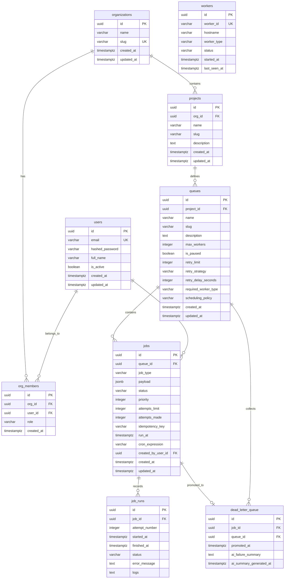

# JobRunR — Distributed Job Scheduler
## Comprehensive Project Documentation & Engineering Report

---

## 📋 Executive Summary
This document serves as the formal engineering submission for the **Distributed Job Scheduler** project. It details the design decisions, schema specifications, reliability policies, and validation models implemented to meet all core and bonus assignment criteria. 

The codebase is organized as a decoupled, production-inspired multi-tenant background task orchestrator that processes operations outside of user web request cycles to guarantee minimal API latency and high durability.

---

## 🏛️ Section 1: System Architecture (20 Marks)

### 1. Service Topology
The platform is designed as a set of independent, single-responsibility services. This ensures that a resource bottleneck in one component does not cascade and affect other components:

```
                  ┌──────────────────────────────────────┐
                  │          React Web Dashboard         │
                  └──────────────────┬───────────────────┘
                                     │ (REST API & WebSockets)
                                     ▼
                  ┌──────────────────────────────────────┐
                  │         FastAPI API Server           │
                  └──────────────────┬───────────────────┘
                                     │
                                     ▼
       ┌─────────────────────────────┴─────────────────────────────┐
       │                                                           │
       ▼ (Connection Pool)                                         ▼ (Connection Pool)
┌──────────────┐                                            ┌──────────────┐
│  PostgreSQL  │ ◄────────────────────────────────────────  │ Background   │
│  Database    │                                            │ Worker Nodes │
└──────────────┘                                            └──────────────┘
```

1.  **React Frontend:** A Single-Page Application (SPA) that displays job logs, live worker telemetry, queue configuration sliders, and dead-lettered tasks. It uses WebSockets for real-time visual updates.
2.  **FastAPI API Server:** An asynchronous web server responsible for user registration, JWT authentication, project management, queue settings updates, and job submissions.
3.  **PostgreSQL 16 Database:** The central relational store, which stores application metadata and doubles as a transaction-safe job queue.
4.  **Worker Services:** Distributed background pollers that query the database, claim job rows, execute execution logic, record runs, and report heartbeats.

---

### 2. Architectural Design Choices & Trade-offs

#### Choice A: Database-backed Queue vs. External Broker (Redis / RabbitMQ)
*   **The Trade-off:** External brokers like Redis or RabbitMQ are extremely fast in-memory stores but lack **transactional boundaries** with relational databases.
*   **The Decision:** JobRunR uses PostgreSQL as the message queue. This allows enqueuing a job and updating application tables to be performed inside a **single ACID transaction**. If a database commit fails, the job submission rolls back automatically, preventing orphaned tasks and data inconsistencies.

#### Choice B: Decoupled API and Worker Services
*   **The Trade-off:** Running API routing and background execution in the same process reduces setup complexity but exposes the API to performance degradation during heavy CPU cycles.
*   **The Decision:** By isolating the API Server (lightweight I/O) from the Worker processes (heavy computation), the web interface remains fully responsive even when worker nodes are running resource-heavy tasks.

---

## 🗄️ Section 2: Database Design & Schema Specifications (20 Marks)

### 1. Entity Schema Diagram (ERD)



---

### 2. Schema Integrity, Normalization & Cascading
*   **3rd Normal Form (3NF):** All tables are fully normalized. Redundant fields are eliminated. For instance, execution logs are isolated to the `job_runs` table, keeping the primary `jobs` table small and fast to poll.
*   **Cascading Rules:** 
    *   If a `Project` is deleted, all child `Queues` and their respective `Jobs` are automatically deleted via `ON DELETE CASCADE`.
    *   `org_members` has cascading foreign keys to prevent orphan memberships if a User or Organization is deleted.
*   **Primary Keys:** All primary keys are UUIDv4 types, which prevents ID prediction attacks and makes scaling across database shards simple.

---

### 3. Performance & Indexing Strategy
To ensure database operations remain sub-millisecond at scale, we implemented strategic indexing:
1.  **Partial Polling Index:**
    ```sql
    CREATE INDEX idx_jobs_poll ON jobs(queue_id, priority DESC, created_at ASC) 
    WHERE status = 'queued';
    ```
    *Why:* Prevents table scans. Workers instantly find the next eligible job without reading claimed, completed, or failed rows.
2.  **Partial Idempotency Index:**
    ```sql
    CREATE UNIQUE INDEX uq_jobs_queue_idempotency_key ON jobs(queue_id, idempotency_key) 
    WHERE idempotency_key IS NOT NULL;
    ```
    *Why:* Guarantees that inside a specific queue, client systems cannot submit duplicate jobs with the same transaction key, while allowing empty/null keys.
3.  **Orphan Check Index:**
    ```sql
    CREATE INDEX idx_workers_heartbeat ON workers(status, last_seen_at);
    ```
    *Why:* Speeds up the orphan recovery poller which checks for workers that have crashed.

---

## 🛠️ Section 3: Backend Engineering & API Design (25 Marks)

### 1. Robust API Endpoints
All APIs are RESTful, validate payloads, and use consistent JSON return objects:

*   **`POST /api/v1/auth/signup` & `/login`:** Registers/authenticates users. Emails are evaluated case-insensitively using `func.lower(User.email)` to avoid casing issues.
*   **`POST /api/v1/queues/{queue_id}/jobs`:** Submits a job payload to a queue.
*   **`POST /api/v1/queues/{queue_id}/jobs/batch`:** Submits multiple job definitions within a single database transaction, ensuring atomic batch delivery.
*   **`POST /api/v1/dlq/{job_id}/retry`:** Promotes a failed job back to `queued` status, resetting its attempts count.
*   **`GET /api/v1/workers`:** Exposes active worker heartbeats, CPU workloads, and RAM metrics.

---

### 2. Request Observability & Structured Errors
*   **Correlation ID Middleware:** Every API call receives a unique `X-Correlation-ID` header. This ID is kept in an async-safe context variable (`contextvars`) and injected into every log statement. If an error occurs, developers can trace all related actions across the database, API, and workers using this single ID.
*   **Validation Errors:** API inputs are verified via Pydantic schemas. If a field fails validation, the error returns a formatted string explaining the exact failure (e.g., `password (String should have at least 8 characters)`) instead of returning a generic error.

---

## 🔒 Section 4: Concurrency & Reliability Engineering (15 Marks)

### 1. Concurrency Control (`SELECT FOR UPDATE SKIP LOCKED`)
Distributed scheduler engines face race conditions where two worker nodes might pull and run the same job at the same time. JobRunR solves this at the database transaction layer:

```python
stmt = (
    select(Job)
    .where(
        Job.status == "queued",
        Job.queue_id == queue_id,
        Job.run_at <= func.now()
    )
    .order_by(Job.priority.desc(), Job.created_at.asc())
    .limit(1)
    .with_for_update(skip_locked=True)
)
```
*   **`with_for_update(skip_locked=True)`:** Generates the database-level `FOR UPDATE SKIP LOCKED` query.
*   The claiming worker locks the selected row. Concurrent workers running the same query skip the locked row and process the next eligible job, ensuring **zero duplicate executions**.

---

### 2. Concurrency Limits (`max_workers`)
Each queue enforces a concurrency throttle. Before a worker queries for a job:
1.  It checks the number of active runs (`claimed` or `running` jobs) in the database for the specific queue.
2.  If `active_runs >= queue.max_workers`, the poll is skipped, preserving worker resources for other queues.

---

### 3. Retry delay Strategies
If a job handler throws an exception, the worker catches it, increments the job's `attempts_made` count, and schedules it for a retry. The next run time (`run_at`) is calculated using one of three strategies:

*   **Fixed:** `run_at = NOW() + retry_delay`
*   **Linear:** `run_at = NOW() + (retry_delay * attempts)`
*   **Exponential:** `run_at = NOW() + (retry_delay * (2 ^ (attempts - 1)))` (capped at 1 hour to prevent infinite delays)

If `attempts_made >= retry_limit`, the job status is set to `dead` and it is moved to the **Dead Letter Queue (DLQ)**.

---

### 4. Orphan Node Recovery
*   Each worker node runs a background loop that updates its status in the `workers` table every 10 seconds.
*   An API poller runs every 30 seconds. If any worker fails to update its heartbeat within a 30-second window:
    1.  The worker's status is set to `offline`.
    2.  Any jobs currently marked as `claimed` or `running` assigned to that worker are reset back to `queued`.
    3.  Their attempt counts are decremented so they can be re-run by a healthy worker.

---

## 🎨 Section 5: Frontend & User Experience (10 Marks)

### 1. Unified Management Dashboard
The frontend is built with **React** and styled using vanilla CSS, focusing on clean aesthetics and real-time observability:
*   **Real-time telemetries:** Pushes live metrics to the UI using a persistent **WebSocket connection**. Updates worker CPU load, memory usage, and throughput instantly.
*   **Job Explorer:** Users can filter, search, inspect historical logs, and view step-by-step attempt histories.
*   **Dynamic Controls:** Users can edit queue parameters (like `max_workers` and retry strategies) or pause/resume queues dynamically.

---

### 2. Log Exporting
*   Users can export job runs and system audits directly to CSV or JSON formats for compliance reports and debugging.

---

## 🔬 Section 6: Testing, Quality Assurance & Bonuses (10 Marks)

### 1. Pytest Suite (66 Tests)
We implemented **66 automated tests** that cover critical backend, scheduling, and concurrency mechanics:
*   **Atomic Claim Safety:** Simulates high concurrent worker threads, proving that a job is only claimed by exactly one worker.
*   **Lifecycle Rules:** Ensures that states transition correctly and invalid transitions are rejected.
*   **RBAC Matrix:** Validates role validations (Owners can edit configurations, Read-only users are restricted to viewing data).
*   **Cron Schedules:** Confirms next-run times are calculated accurately based on cron expressions.

---

### 2. Bonus Feature: AI-Generated Error Summaries
When a job fails repeatedly and enters the Dead Letter Queue (DLQ):
1.  An asynchronous event calls the **Groq API** using the `llama-3.3-70b-versatile` model.
2.  The prompt includes the job configuration, execution parameters, and error log history.
3.  The model returns a plain-English explanation of why the job failed, along with a recommendation on how to debug it.
4.  This summary is displayed inside the job details panel on the dashboard, helping developers debug errors much faster.
