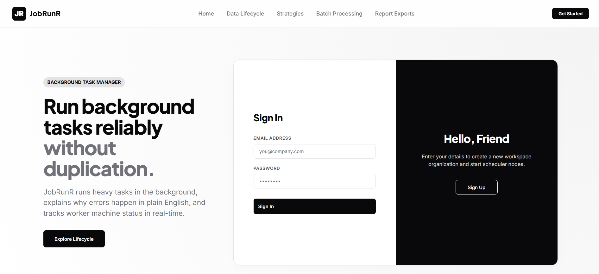
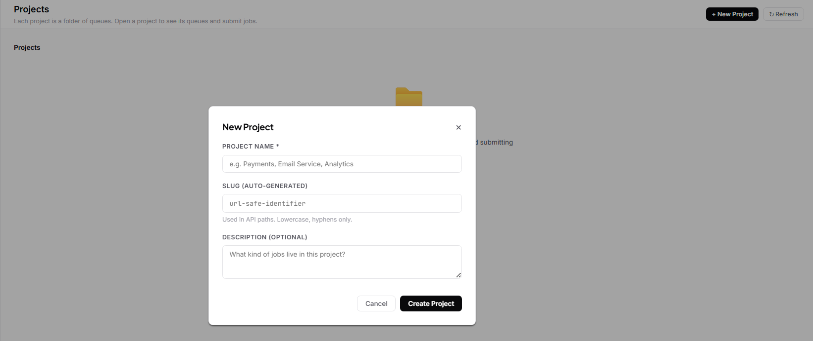
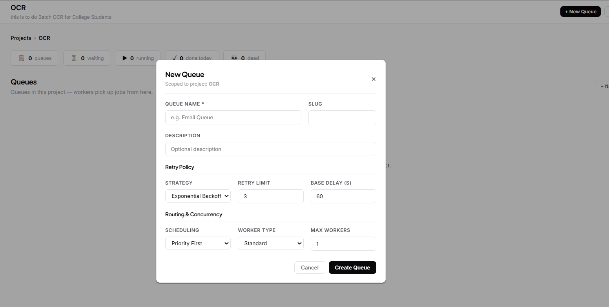
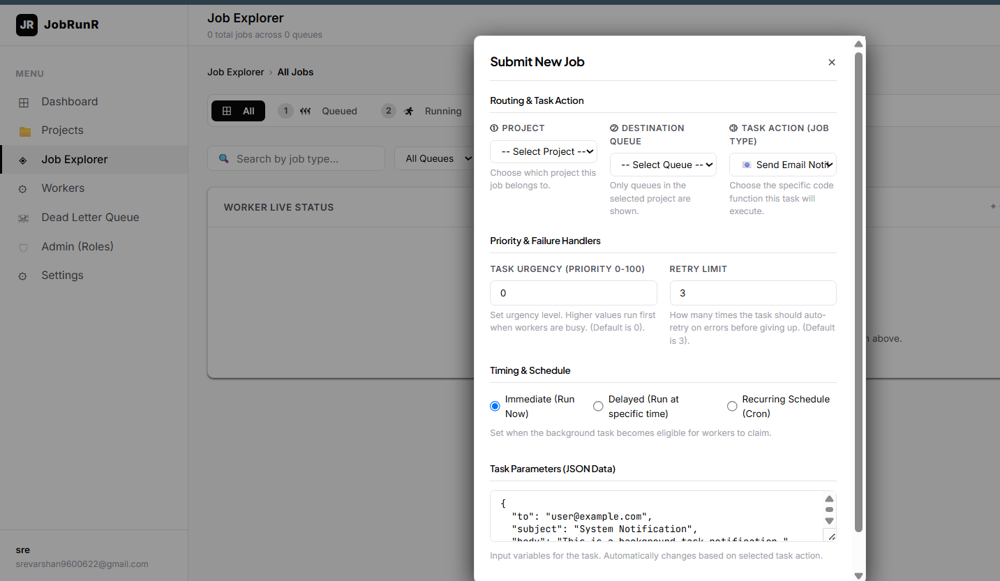

# JobRunR — Distributed Job Scheduler

A production-grade distributed background job scheduling platform built with **FastAPI**, **PostgreSQL**, and **React**. Designed for reliable, claim-safe task orchestration at scale.

---

## 🖥️ Screen Previews

### 1. Landing & Authentication Page


### 2. Creating Projects in Organizations


### 3. Configuring New Queues


### 4. Submitting Background Jobs


---

## ⚙️ Clone & Setup

First, clone the repository and navigate to the project directory:
```bash
git clone https://github.com/Srevarshan05/distributed-job-scheduler
cd distributed-job-scheduler
```

Choose one of the two options below to run the application:
* **Option A (Easiest):** Run the entire stack inside Docker.
* **Option B (Recommended for Dev):** Run the database in Docker, and run the FastAPI backend, workers, and React frontend natively on your host machine.

---

### Option A: Run Everything in Docker

Follow these 4 simple steps:

1. **Copy the environment file:**
   * **Windows CMD:** `copy .env.example .env`
   * **Windows PowerShell:** `Copy-Item .env.example .env`
   * **macOS / Linux:** `cp .env.example .env`

2. **Start the containers (with clean builds):**
   ```bash
   docker compose down -v
   ```
   ```bash
   docker compose up --build --force-recreate
   ```
   *(Note: Wiping old volumes with `-v` is highly recommended to clear legacy database states.)*

3. **Access the application:**
   * **Web Dashboard:** [http://localhost:5173](http://localhost:5173) (Log in with `admin@example.com` / `password123`)
   * **API Swagger Docs:** [http://localhost:8000/docs](http://localhost:8000/docs)

4. **Wipe database & clean up:**
   ```bash
   docker compose down -v
   ```

---

### Option B: Run Database in Docker + Apps Locally (Hybrid)

This setup is ideal if you want to make fast code changes locally without rebuilding Docker images. We provide automated click-and-run scripts that handle environment checks, dependencies, database setup, migrations/seeding, and startup.

#### The Quick Way: Click-and-Run

* **Windows:**
  Simply **double-click the `start.bat`** file in your file explorer.
  *(This starts a Command Prompt that installs Python/Node requirements, launches the database container on host port `5433`, runs migrations/seeding, and spawns three separate CMD windows running the backend, worker, and frontend dev servers.)*

* **macOS / Linux:**
  Give execution permissions and run:
  ```bash
  chmod +x start.sh
  ./start.sh
  ```
  *(This script verifies your local tools, runs the database container, installs packages, runs migrations, and uses `npx concurrently` to run all three services in a single terminal window with colored logs.)*

* Access the Web Dashboard at **[http://localhost:5173](http://localhost:5173)**.
* Login with: **`admin@example.com` / `password123`**.

---

#### The Manual Way: Step-by-Step Commands

If you prefer to configure everything manually, run these steps in order:

##### 1. Start the Database Container
We use Docker to run the database so you don't need to install PostgreSQL on your machine:
```bash
docker compose up db -d
```
*(Starts PostgreSQL on host port `5433` using a named volume `pgdata` to persist records.)*

##### 2. Configure Environment variables
Copy the environment template:
* **Windows CMD:** `copy .env.example .env`
* **Windows PowerShell:** `Copy-Item .env.example .env`
* **macOS / Linux:** `cp .env.example .env`

*(By default, the `.env` is configured to connect to port `5433` on your localhost.)*

##### 3. Setup and Run the Backend API
In a new terminal:
```bash
# 1. Create a Python virtual environment
python -m venv .venv

# 2. Activate the virtual environment
.venv\Scripts\activate          # Windows PowerShell/CMD
# source .venv/bin/activate    # macOS/Linux

# 3. Install requirements
pip install -r backend/requirements.txt

# 4. Run migrations & seed data
cd backend
alembic upgrade head
python ../scripts/seed.py

# 5. Start backend server
uvicorn app.main:app --host 127.0.0.1 --port 8000 --reload
```

##### 4. Run the Worker Nodes
In **two separate terminals** (make sure virtual environment is active in both):

* **Terminal 1 (Standard Worker):**
  ```bash
  cd worker
  pip install -r requirements.txt
  # Set worker configuration and run
  # Windows Cmd:
  set WORKER_ID=standard-1
  set WORKER_TYPE=standard
  uvicorn app.main:app --host 127.0.0.1 --port 8001 --reload
  # macOS/Linux/PowerShell:
  # WORKER_ID=standard-1 WORKER_TYPE=standard uvicorn app.main:app --host 127.0.0.1 --port 8001 --reload
  ```

* **Terminal 2 (High-Compute Worker):**
  ```bash
  cd worker
  # Set worker configuration and run
  # Windows Cmd:
  set WORKER_ID=high-1
  set WORKER_TYPE=high_compute
  uvicorn app.main:app --host 127.0.0.1 --port 8002 --reload
  # macOS/Linux/PowerShell:
  # WORKER_ID=high-1 WORKER_TYPE=high_compute uvicorn app.main:app --host 127.0.0.1 --port 8002 --reload
  ```

##### 5. Run the Frontend Dashboard
In a new terminal:
```bash
cd frontend
npm install
npm run dev
```

---

## 🌟 Key Features

### 1. Hierarchy & Multi-Tenancy
- **Organizations:** Top-level tenancy. Users can invite members and manage workspaces.
- **Projects:** Logical boundaries inside organizations to isolate workflows.
- **Queues:** Dedicated pipelines inside projects with configurable rules.
- **Jobs:** Individual background payloads executed by worker nodes.

### 2. Advanced Queue Controls
- **Strict Concurrency Limits (`max_workers`):** Restricts the number of active workers allowed to claim from a queue simultaneously.
- **Dynamic Pause/Resume:** Instantly block workers from claiming new jobs from a queue, then resume when ready.
- **Flexible Scheduling Policies:**
  - **Priority:** Processes higher-priority jobs first.
  - **FIFO:** Processes older jobs first.
  - **Fair-Share:** Distributes executions evenly across different job types.

### 3. Worker Architecture & Safety
- **Atomic Claiming:** Uses `SELECT FOR UPDATE SKIP LOCKED` database transactions to prevent race conditions. Two worker nodes will never run the same job.
- **Heartbeat & Telemetry:** Worker nodes report active heartbeats and host system telemetry (CPU core load and Memory usage via `psutil`).
- **Orphan Recovery:** Automatically detects crashed worker nodes and recycles unfinished jobs back to the queue.
- **Dead Letter Queue (DLQ):** Failed jobs are sent to the DLQ after exhausting their retries, preserving logs and failure reasons.

### 4. Observability & AI
- **WebSockets:** Real-time updates push job progress and active worker metrics directly to the React frontend.
- **AI-Powered Diagnostics (Groq):** Generates plain-English summaries explaining why a job failed (utilizing `llama-3.3-70b-versatile` LLaMA model).
- **Log Exporting:** Developers can export detailed job execution run histories as CSV or JSON.

---

## 📂 Project Structure

```
distributed-job-scheduler/
├── backend/                 # FastAPI API server
│   ├── app/
│   │   ├── core/            # DB sessions, native bcrypt security, correlation IDs
│   │   ├── models/          # SQLAlchemy ORM schemas
│   │   ├── routers/         # REST API routers (case-insensitive emails)
│   │   └── schemas/         # Pydantic payloads
│   ├── alembic/             # Database migrations
│   ├── Dockerfile
│   └── entrypoint.sh        # Runs migrations + seeds + uvicorn
├── worker/                  # Background worker (standard and high compute)
│   ├── app/
│   │   ├── core/            # Polling loops, row locking, psutil telemetry
│   │   ├── handlers/        # Job handlers (email, cpu_burn)
│   │   └── ai_summary.py    # Isolated Groq LLM summary generation
│   └── Dockerfile
├── frontend/                # React SPA
│   ├── src/
│   │   ├── pages/           # Dashboard, JobExplorer, Projects, Workers, DLQ
│   │   └── lib/             # Dynamic WS base url & relative API clients
│   ├── vite.config.js       # Auto-dev server proxy for api and websockets
│   ├── nginx.conf           # Docker SPA routing fallback
│   └── Dockerfile
├── scripts/
│   └── seed.py              # Repetitive seed with auto-repair admin password
├── start.bat                # Windows double-click launcher
├── start.sh                 # macOS/Linux multiplexed launcher
├── docker-compose.yml       # Production-ready stack compose
└── .env.example             # Template with default localhost:5433 variables
```

---

## 🛡️ Roles & Permissions

| Action | Owner | Member | Read-only |
|---|---|---|---|
| View jobs / queues / logs | ✅ | ✅ | ✅ |
| Submit jobs | ✅ | ✅ | ❌ |
| Cancel jobs | ✅ | ✅ | ❌ |
| Pause / resume queue | ✅ | ❌ | ❌ |
| Create / delete project | ✅ | ❌ | ❌ |
| Invite users | ✅ | ❌ | ❌ |
| Retry DLQ entries | ✅ | ❌ | ❌ |

---

## 🧪 Running Tests

To verify the scheduler logic, run the Pytest suite from the root directory (make sure your `.venv` is active):
```bash
python -m pytest backend/tests/test_scheduler_logic.py -v
```
*Tests cover: retry strategies, job lifecycle states, DLQ promotions, priority sorting, RBAC policies, cron executions, and concurrent claim safety.*
